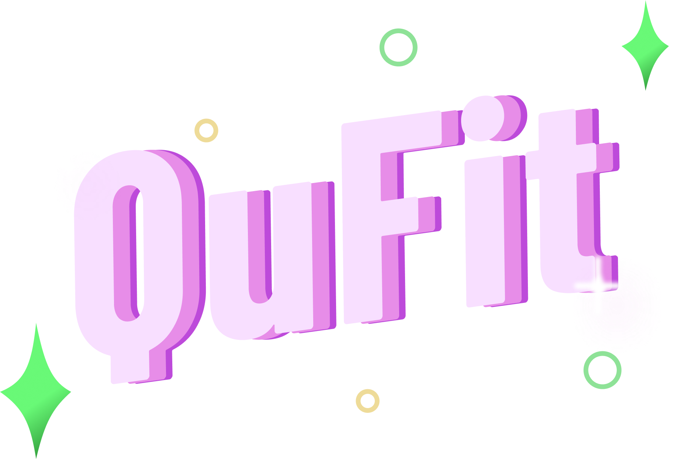

# 🎭 QUFIT - AR 블라인드 소개팅 

<div align="center">


> **새로운 만남의 방식, 저출산 문제를 해결하는 혁신적인 소개팅 플랫폼**  
> **개발기간: 2024.06 ~ 2024.08 (7주)**
</div>

## <span style = "color:RED">프로젝트 기획 배경 작성하기 ! ? ! ? ! ? ! ? ! ? ! ? </span>

## 💡 프로젝트 소개

QUFIT은 AR 기술을 활용한 혁신적인 블라인드 소개팅 서비스입니다. 저출산 문제 해결을 위해 청년들의 만남을 새로운 방식으로 지원합니다. 사용자의 얼굴을 직접적으로 노출하지 않으면서도 상대방의 외적, 성격적 이미지를 파악할 수 있는 독특한 경험을 제공합니다. 💑

QUFIT은 기존 데이팅 앱의 한계를 극복하고, 온라인 환경에서 로테이션 단체 미팅의 장점을 살린 새로운 형태의 소개팅 플랫폼입니다. AR 마스크를 통해 익명성을 보장하면서도 실시간 상호작용이 가능한 환경을 제공하여, 외모보다는 성격과 대화를 중심으로 상대방을 알아갈 수 있도록 돕습니다. 🎭

프로젝트를 통해 청년들의 새로운 만남의 기회를 제공하고, 궁극적으로는 저출산 문제 해결에 기여하는 것이 QUFIT의 목표입니다. 앞으로도 QUFIT은 사용자들의 피드백을 반영하며 지속적으로 서비스를 개선해 나갈 예정입니다. 🎯

### 🌟 주요 특징

- **AR 마스크 기술** : 사용자의 얼굴을 가리면서도 감정을 전달 🤡
- **실시간 상호작용** : WebRTC 기반의 화상 채팅으로 생동감 있는 대화 💬
- **태그(관심사) 기반 매칭** : 성격, 취미, 가치관을 고려한 지능적인 매칭 시스템 🧠
- **밸런스 게임** : 재미있는 게임을 통해 서로를 더 깊이 이해하는 기회 ⚖️
- **안전한 환경** : 철저한 인증 시스템으로 신뢰할 수 있는 만남 보장 🔒

### 💖 QUFIT의 비전

QUFIT은 단순한 소개팅 앱을 넘어, 사회적 문제 해결에 기여하고자 합니다. 저희의 목표는:

1. **청년들의 새로운 만남 촉진** : 부담 없이 다양한 사람을 만날 수 있는 플랫폼 제공
2. **건전한 데이팅 문화 조성** : 외모보다는 성격과 가치관 중심의 만남 유도
3. **저출산 문제 해결에 기여** : 의미 있는 만남을 통해 장기적으로 출산율 향상에 기여

### 🚀 미래 계획

QUFIT은 지속적인 기술 혁신과 사용자 피드백을 바탕으로 서비스를 발전시켜 나갈 것입니다. AR 기술 고도화, 로드 밸런서 도입 일대일 매칭 개선, 다양한 상호작용 기능 추가 등을 통해 사용자 경험을 끊임없이 향상시키겠습니다.

**QUFIT과 함께, 새로운 만남의 혁명을 경험해보세요!** 🌈

## 🎞️ UCC 영상
↓ 클릭 후 UCC 페이지로 이동 <br>
<a href="https://www.youtube.com/watch?v=xBanjxDa1sg">
    
</a>

블라인드 소개팅, QuFit UCC 입니다.


## 👥 팀 소개

### 백엔드

|    천세경      |          조현수         |          장혜원         |          김해엽         |                                                                                                               
| :---: | :---: | :---: | :---: |
|       |       |       |       |
|   [@GitHub ID](https://github.com/[ID])   |    [@HyunSoo](https://github.com/HyunSoo730)  |    [@GitHub ID](https://github.com/[ID])  |    [@GitHub ID](https://github.com/[ID])  |
| SSAFY | SSAFY | SSAFY | SSAFY |

### 프론트엔드

|    송현명      |          박세은         |                                                                                                               
| :---: | :---: | 
|       |       |
|   [@GitHub ID](https://github.com/[송현명 GitHub ID])   |    [@GitHub ID](https://github.com/[박세은 GitHub ID])  |
| SSAFY | SSAFY |


## 🌈 이용 가이드

### 💨 Requirements

프로젝트를 빌드하고 실행하기 위해 다음 환경이 필요합니다:

- [Docker](https://www.docker.com/)
- [Docker Compose](https://docs.docker.com/compose/)

### 😎 Installation

```
1. 프로젝트 클론
$ git clone [프로젝트 레포지토리 URL]
$ cd [프로젝트 디렉토리 이름]

2. 환경 변수 설정
# Back-end 환경 변수 설정
$ cp back-end/.env.example back-end/.env
# 필요한 환경 변수 값 설정

# Front-end 환경 변수 설정
$ cp front-end/.env.example front-end/.env
# 필요한 환경 변수 값 설정

3. Docker Compose를 사용하여 애플리케이션 실행
$ docker compose up -d --build

이 명령어는 백엔드, 프론트엔드, Redis 서비스를 빌드하고 실행합니다. 
- 백엔드 서비스는 8080 포트에서 실행됩니다.
- 프론트엔드 서비스는 80 포트(HTTP)와 443 포트(HTTPS)에서 실행됩니다.
- Redis 서비스는 6379 포트에서 실행됩니다.

4. 애플리케이션 접속
- 웹 브라우저에서 https://localhost 또는 http://localhost로 접속하여 애플리케이션을 이용할 수 있습니다.

5. 애플리케이션 중지
$ docker compose down
이 명령어는 실행 중인 모든 서비스를 중지하고 컨테이너를 제거합니다.
```

## 🛠️ 기술 스택

### 💻 Language


### 🏗️ Framework & Library
#### 🔙 Backend


#### 🖼️ Frontend


### ⚙️ Config
#### 🖥️ Frontend


#### 🔧 Backend


### 🤝 Communication


### 🗄️ Database


### 🚀 DevOps


### 🎨 Etc


## 📊 ERD (Entity-Relationship Diagram)


주요 도메인은 회원, 채팅, 밸런스 게임, 화상 채팅방, 친구 관계 등으로 구성되어 있습니다. 모든 다대다 관계는 중간 매핑 테이블을 통해 관리되고 있습니다.

### 주요 도메인 및 엔티티 설명

1. 회원 (Member) 도메인
   - `member`: 사용자의 기본 정보를 저장합니다. 이름, 이메일, 비밀번호, 성별, 생년월일 등의 정보를 포함합니다.
   - `location`: 회원의 위치 정보를 별도로 관리합니다.
   - `type_profiles`, `member_personality`, `member_hobby`: 회원의 이상형 프로필 타입, 성격, 취미 정보를 각각 관리합니다.
   - `tag`: 회원과 관련된 태그를 저장하며, `tag_id`를 통해 회원과 연결됩니다.

2. 채팅 (Chat) 도메인
   - `chat_room`: 채팅방 정보를 관리합니다.
   - `chat_room_member`: 채팅방 참여자 정보를 관리하는 중간 테이블입니다.
   - 채팅 내역은 mongoDB(noSQL)을 통해서 기록합니다.

3. 화상 채팅 (Video Room) 도메인
   - `video_room`: 화상 채팅방 정보를 저장합니다.
   - `video_room_participant`: 화상 채팅 참여자 정보를 관리하는 중간 테이블입니다.
   - `video_room_personality`, `video_room_hobby`: 화상 채팅방의 성격, 취미 정보를 연결합니다.

4. 밸런스 게임 (Balance Game) 도메인
   - `balance_game`: 밸런스 게임의 기본 정보를 저장합니다.
   - `balance_game_choice`: 밸런스 게임의 선택지 정보를 관리합니다.

5. 친구 관계 (Friend Relationship) 도메인
   - `friend_relationship`: 회원 간의 친구 관계를 관리합니다. 


## 💪 주요 기능

### ⭐️ AR 기술을 활용한 블라인드 소개팅
Google MediaPipe와 Three.js를 결합하여 실시간으로 사용자의 얼굴에 AR 마스크를 적용합니다. 468개의 얼굴 랜드마크 포인트를 추적하여 자연스러운 마스크 움직임을 구현하였습니다. 👹

### ⭐️ 실시간 다대다 화상 미팅
WebRTC 기술을 기반으로 한 OpenVidu(Live-Kit)를 사용하여 최대 8(4대4)명까지 동시에 참여할 수 있는 실시간 화상 미팅을 지원합니다. 화상 영상 및 음성 통화로 자연스러운 소개팅 경험을 제공합니다. 👥

### ⭐️ AI 기반 프로필 이미지 생성
OpenAI의 DALL-E 3 모델을 활용하여 사용자의 성격, 취미, 관심사를 반영한 독특하고 개성 있는 동물 프로필 이미지를 자동으로 생성합니다. 텍스트 설명만으로 사용자의 특성을 시각화하여 매력적인 프로필을 만들 수 있습니다. 🎨

### ⭐️ 실시간 밸런스 게임
WebSocket을 이용한 실시간 밸런스 게임 시스템으로, 참가자들의 성향과 가치관을 재미있게 탐색할 수 있습니다. 게임 결과를 바탕으로 일대일 매칭을 진행한 후 남녀 1:1 방으로 이동하여 소개팅을 진행합니다. ⚖️

### ⭐️ 태그(관심사) 기반 맞춤형 방 추천
Elasticsearch를 활용하여 사용자의 성격, 취미, 관심사를 분석하고, 이를 바탕으로 최적의 소개팅 방을 추천합니다(관심사 기반). 사용자 프로필 데이터에 가중치를 적용한 고급 검색 알고리즘으로 호환성 높은 방을 제안합니다. 🔍

### ⭐️ 실시간 채팅 시스템
WebSocket과 STOMP 프로토콜을 이용한 실시간 채팅 기능으로 즉각적이고 원활한 커뮤니케이션을 지원합니다. MongoDB를 활용하여 채팅 내역을 효율적으로 저장하고 관리합니다. 💬

### ⭐️ 보안 강화 로그인 시스템
Spring Security와 JWT를 결합하여 안전하고 효율적인 인증 시스템을 구축했습니다. 카카오 소셜 로그인을 통해 사용자 편의성을 높이고, 비밀번호 없는 로그인으로 보안을 강화했습니다. 자동 로그인 기능으로 사용자 경험을 개선했습니다. 🔐

### ⭐️ 반응형 웹 디자인
Tailwind CSS를 활용하여 다양한 디바이스와 화면 크기에 최적화된 반응형 웹 디자인을 구현했습니다. 어떤 환경에서도 일관된 사용자 경험을 제공합니다. 📱💻


## 📺 화면 소개
### (1) 소개 페이지
| 소개 페이지 | 홍보 영상 페이지 |
|:---------|:-----------|
|  |  |
| - 서비스를 소개합니다.<br> - `[kakao Login]` 버튼으로 로그인을 진행합니다.<br> - `[더 알아보기]` 버튼으로 서비스 홍보 영상을 확인합니다. | - 홍보 영상을 확인합니다.<br> - 위로 스크롤하여 소개 페이지로 돌아갑니다. |
### (2) 회원 관련 페이지
| 카카오 소셜 로그인 페이지 | 회원가입 페이지 | 회원가입 페이지2 |
|:---------|:-----------|:-----------|
|  |  |  |
| - 소셜 이메일 정보를 수집합니다. | - 본인의 정보(mbti, 성격, 취미 등)를 수집합니다.<br> - 이상형의 정보(나이차, mbti, 성격, 취미)을 수집합니다. | - `[시작하기]`버튼으로 회원가입을 완료합니다. <br> - 회원가입을 완료한 회원은 '가입 대기 중' 회원입니다. 관리자가 승인 후 로그인이 가능합니다. |

| 마이페이지(회원 정보) 페이지1 | 마이페이지(이상형 정보) 페이지 |
|:---------|:-----------|
|  |  |
| - 회원 정보(mbti, 성격, 취미)를 확인합니다.<br> - `[프로필 수정]`버튼으로 정보를 수정합니다.<br> - `[AI에게 프로필 생성받기]`버튼으로 내 정보에 맞는 동물 프로필 사진을 추천받습니다. | - 이상형 정보(나이차, mbti, 성격, 취미)를 확인/수정합니다. |

### (3) 메인 페이지
| 메인 페이지 |
|:---------|
|  |
| - 로그인 성공 후 첫 페이지입니다.<br> - `[채팅]` 버튼으로 친구 목록을 확인합니다.<br> - `[마이페이지]` 버튼으로 마이페이지를 확인합니다.<br> - `[방 만들기]` 버튼으로 미팅방을 생성합니다.<br> - `[방 추천받기]` 버튼으로 미팅방을 추천받습니다. <br> - `[Filter]` 버튼으로 미팅방 리스트를 필터링합니다. |

### (4) 화상 미팅 방 관련 페이지
| 방 생성 페이지1 | 방 생성 페이지2 | 방 생성 페이지3 |
|:---------|:-----------|:-----------|
|  |  |  |
| - 방 제목과 참여 인원 성비, 어떤 태그를 선택할 것인지 선택합니다. | - 방 태그를 선택합니다. | - 생성될 방의 입장 버튼 미리보기를 확인합니다. <br> - `[방 만들기]`버튼으로 방을 생성합니다. |

| 방 태그 필터 | 방 추천 페이지 |
|:-----------|:-----------|
|  |  |
| - 방 리스트를 필터링 할 태그를 선택합니다. <br> - `[검색]` 창에서 태그를 검색합니다. | - 내 정보와 이상형 정보를 바탕으로 추천받은 방 리스트를 확인합니다. <br> - `[다시 추천받기]`버튼으로 방을 다시 추천받습니다. |

| 다대다 화상 미팅 페이지 | 다대다 화상 미팅 종료 페이지 |
|:---------|:-----------|
|  | |
| - 위 화면은 남성, 아래 화면은 여성 참여자의 화면이 보입니다. <br> - 방장은 왕관 스티커로 구분합니다. <br> - `[start]` 버튼으로 미팅을 시작합니다. <br> - 방장만 미팅을 시작할 수 있습니다.| - `[이동하기]`버튼으로 1:1 미팅방으로 이동합니다. |

| 밸런스 게임 시작 페이지 | 밸런스 게임 선택 페이지 | 
|:-----------|:-----------|
|  |  | 
| - `[CLICK START]`버튼으로 밸런스 게임을 시작합니다. | - 게임 설명을 보고, 선택지를 각자 선택합니다. |

| 일대일 화상 미팅 페이지 | 일대일 화상 미팅 종료 페이지 |
|:-----------|:-----------|
|  |  |
| - 화면 상단에 남은 시간을 확인합니다. <br> - 화면 하단에 밸런스 게임 결과를 확인합니다. | - 상대방과 매칭되었는지 확인합니다.

### (5) 채팅 관련 페이지
| 친구목록 페이지 | 채팅 페이지 |
|:---------|:-----------|
|  |  |
| - 일대일 미팅으로 매칭된 친구 목록을 확인합니다. <br> - `[채팅]`버튼으로 친구와 채팅을 시작합니다. | - 기존 채팅 목록을 확인합니다. <br> - 우측에서 친구와 채팅 내용과 채팅 입력을 합니다. |

## 🎉 Flow Chart


## 🏛️ 인프라 아키텍처


저희 프로젝트의 인프라 아키텍처는 현재 모놀리식 구조로 시작했으며, 향후 성능 개선과 확장성을 위한 고도화 계획을 가지고 있습니다.

### 👍 1. 현재 아키텍처 (모놀리식)

#### 네트워크 및 보안
- EC2 인스턴스에서 80(HTTP)과 443(HTTPS) 포트만 외부에 개방하여 보안을 강화했습니다.
- Nginx를 리버스 프록시로 사용하여 들어오는 모든 트래픽을 관리하고 적절히 라우팅합니다:
  - `/`: 프론트엔드 애플리케이션으로 라우팅
  - `/qufit`: 백엔드 API 서버로 요청 전달
  - `/openvidu`: OpenVidu(Live-Kit) 서버로 WebRTC 관련 요청 전달

#### 컨테이너화
- 모든 서비스(프론트엔드, 백엔드, ElasticSearh, OpenVidu, LiveKit 등)는 단일 EC2 인스턴스 내에서 Docker 컨테이너로 실행됩니다.
- Docker Compose를 사용하여 다중 컨테이너 애플리케이션을 정의하고 실행합니다.

#### CI/CD 파이프라인
- GitLab을 사용하여 소스 코드를 관리하고, Webhook을 통해 변경 사항을 감지합니다.
- Jenkins를 CI/CD 도구로 사용하여 자동화된 빌드, 테스트, 배포 프로세스를 구현했습니다.

#### 데이터 관리
- RDS MariaDB을 사용하여 영구 데이터를 관리합니다.
- Redis를 사용하여 세션 데이터와 캐시를 처리합니다.
- Amazon S3를 사용하여 정적 파일과 사용자 업로드 파일을 저장합니다.

### 👍 2. 향후 고도화 계획

#### 마이크로서비스로의 전환
- AR 기능과 Elasticsearch를 별도의 서비스로 분리하여 독립적으로 스케일링할 수 있도록 할 예정입니다. (현재 CPU & 메모리의 대부분을 차지하고 있어 많이 느립니다...)
- 각 서비스를 개별 Docker 컨테이너로 패키징하고, Kubernetes를 도입하여 오케스트레이션을 관리할 계획입니다.

#### 로드 밸런싱 및 고가용성
- Elastic Load Balancer(ELB)를 도입하여 여러 EC2 인스턴스에 트래픽을 분산시킬 예정입니다.
- Auto Scaling 그룹을 구성하여 트래픽 증가에 따라 EC2 인스턴스를 자동으로 확장할 계획입니다.

#### 성능 최적화
- AR 서비스와 Elasticsearch를 위한 전용 고성능 EC2 인스턴스를 별도로 운영할 예정입니다.

단계적인 마이크로서비스 전환과 클라우드 네이티브 기술의 도입으로 더욱 유연하고 강력한 인프라를 구축하고자 합니다 !


## 📊 순서도

### 로그인 / 회원가입 프로세스


### 이미지 생성 프로세스


### WebSocket 연결 및 채팅 프로세스


### ElasticSearch를 이용한 방 추천 프로세스


### OpenVidu를 이용한 블라인드 소개팅 연결 프로세스


### 일대일 매칭 프로세스


### 밸런스 게임 진행 프로세스


## 🎉 프로젝트 결과 및 성과

🔹 혁신적인 AR 소개팅 경험 구현 🤳
   - WebRTC와 AR 기술을 결합한 독특한 블라인드 소개팅 플랫폼 개발
   - Google MediaPipe와 Three.js로 실시간 AR 마스킹 기능 구현

🔹 효율적인 개발 및 배포 프로세스 🚀
   - Jenkins를 활용한 자동화된 CI/CD 파이프라인 구축
   - Docker 컨테이너화로 애플리케이션 일관성 및 이식성 향상
   - GitLab과 Jenkins 연동으로 효율적인 버전 관리 및 자동 빌드/배포 시스템 구현

🔹 AI 기반 사용자 경험 개선 🧠
   - OpenAI의 DALL-E 3 모델을 이용한 AI 기반 프로필 이미지 생성 시스템 구현
   - Elasticsearch를 활용한 효율적인 방 추천 및 검색 시스템 개발

🔹 실시간 상호작용 기능 강화 🎮
   - 실시간 밸런스 게임으로 사용자 상호작용 증대 및 매칭 정확도 향상
   - WebSocket과 STOMP 프로토콜 기반 실시간 채팅 시스템 구현

🔹 데이터 관리 및 보안 강화 🔒
   - MongoDB를 활용한 채팅 메시지 저장 및 효율적인 조회 기능 구현
   - ChannelInterceptor를 이용한 WebSocket Security 강화로 안전한 실시간 통신 환경 구축

## 🔧 개선 사항 및 추후 계획

🔮 AR 기능 확장
   - AR 마스크 다양성 확대 및 사용자 지정 마스크 기능 개발

🔀 아키텍처 개선
   - 마이크로서비스 아키텍처 검토 및 단계적 도입
   - Apache Kafka/RabbitMQ 기반 메시지 큐 시스템 도입 검토 (동기 처리 -> 비동기 처리를 통해 성능 개선)

⚖️ 성능 최적화
   - AR 및 Elasticsearch 처리를 위한 로드 밸런싱 시스템 구축
   - 서비스 성능 모니터링 및 자동 스케일링 시스템 도입

🧠 AI 기능 강화
   - 사용자 AI 감정 분석 기능 도입 계획

## 🚨 트러블슈팅

### 🔐 WebSocket JWT 인증 문제
🔍 증상: WebSocket 연결 시 JWT 토큰 인식 실패, 사용자 식별 불가

🧐 원인:
   - WebSocket과 HTTP 인증 메커니즘 불일치
   - Spring Security와 WebSocket 비동기 특성 간 충돌
   - 세션 간 인증 정보 유지 로직 부재

✅ 해결:
   - ChannelInterceptor로 WebSocket 핸드셰이크 시 JWT 토큰 검증
   - WebSocket 세션에 검증된 사용자 정보 저장
   - Spring Security와 통합을 위한 인증 토큰 생성
   - 모든 메시지에 대한 세션 기반 인증 확인

🎉 결과: 안전한 WebSocket 연결 구현

### 💬 실시간 채팅 성능 개선
🔍 증상: 채팅방 입장 및 메시지 로딩 지연

🧐 원인: 빈번한 DB 조회로 인한 병목 현상

✅ 해결:
   - Redis를 활용한 채팅 메시지 캐싱 시스템 구축
   - 최근 메시지 및 읽지 않은 메시지 카운트 Redis 저장
   - 캐시 우선 조회 후 점진적 DB 조회 방식 도입

🎉 결과: 채팅 로딩 속도 향상 및 DB 부하 감소

### 🛠️ Jenkins CI/CD 파이프라인 구축
🔍 증상: Docker 이미지 빌드 실패 및 배포 오류

🧐 원인:
   - Jenkins 컨테이너 내 Docker 실행 권한 문제
   - Jenkins-GitLab 연동 설정 오류

✅ 해결:
   - Jenkins 컨테이너에 Docker 소켓 마운트 및 권한 설정
   - GitLab 접근을 위한 SSH 키 및 Personal Token 설정

🎉 결과: 안정적인 자동화 빌드 및 배포 시스템 구축

### 🎭 3D 마스크 모델 렌더링 문제
🔍 증상: 3D 마스크 모델 화면 미표시

🧐 원인:
   - 모델 로딩 및 렌더링 설정 오류
   - 부적절한 카메라 시야, 모델 크기, 조명 설정

✅ 해결:
   - GLTFLoader 사용 및 디버깅 로그 추가
   - 모델 크기, 위치, 조명 최적화
   - 모델 투명도 조정

🎉 결과: 3D 마스크 정상 렌더링으로 AR 경험 향상

### 👤 얼굴 인식 정확도 개선
🔍 증상: 기존 라이브러리 사용 시 인식 정확도 부족

🧐 원인: face-api.js 성능 문제, mind AR과 TypeScript 호환성 이슈

✅ 해결:
   - MediaPipe FaceLandmarker 라이브러리 도입
   - 468개 얼굴 특징점 활용한 정확한 추적 구현
   - 실시간 반응성 최적화

🎉 결과: AR 마스크 자연스러운 적용으로 사용자 경험 개선


이러한 트러블슈팅 경험을 통해 서비스의 안정성과 성능을 향상시켰으며, QuFit을 이용하는 회원들에게 더 나은 경험을 제공할 수 있게 되었습니다. 앞으로도 지속적인 개선을 통해 최고의 블라인드 소개팅 앱을 만들어 보겠습니다 !
